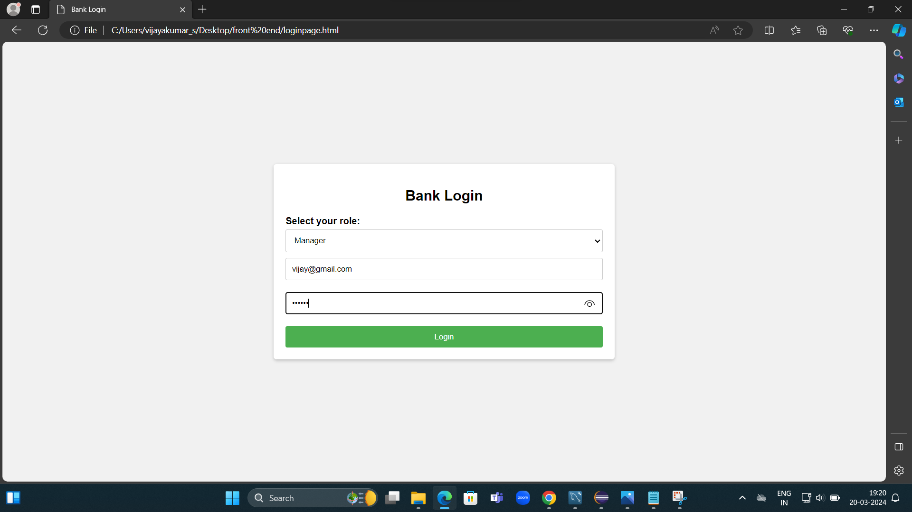
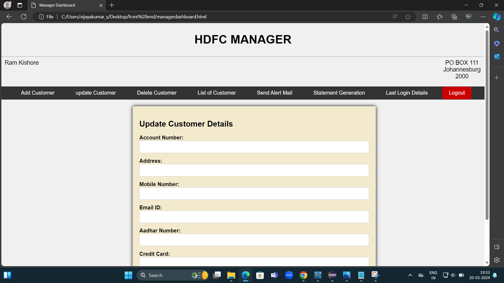
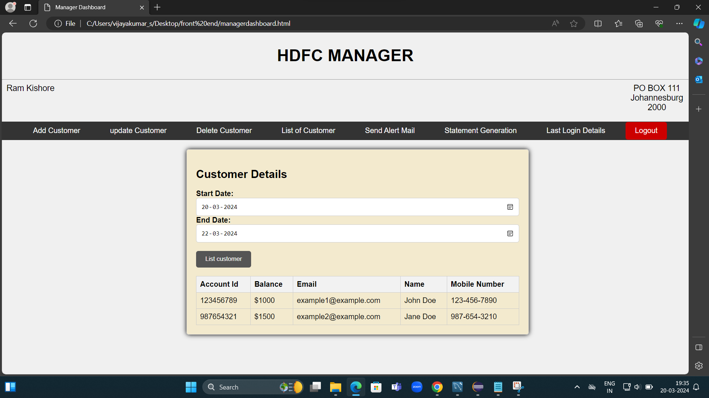
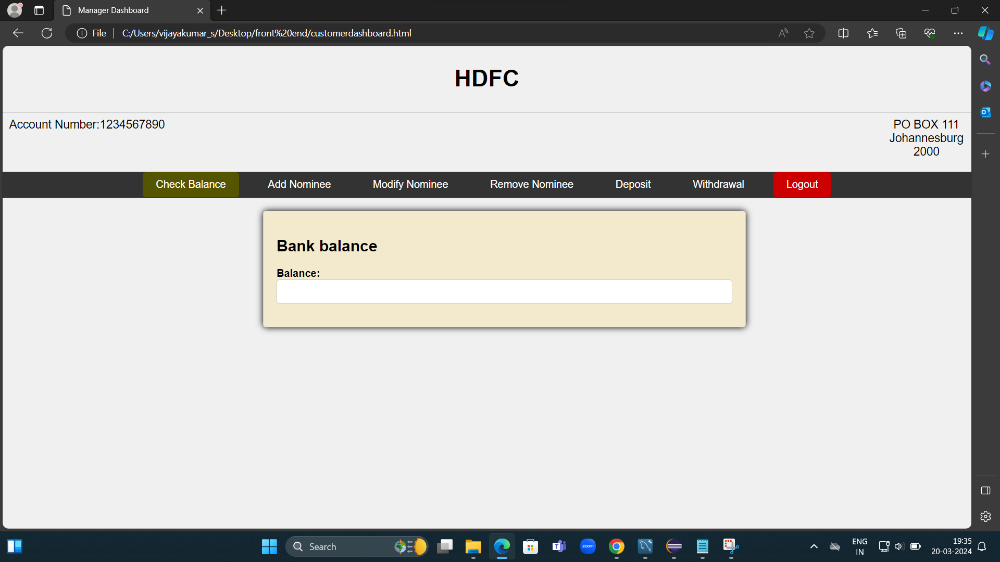
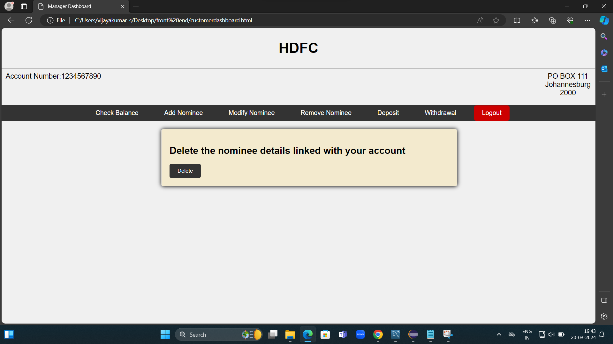

# Bank Transaction
## Introduction
Welcome to the frontend documentation for the Bank Transaction. This document provides an overview of the user interface components, layouts, functionalities, and interactions of the frontend part of the system.

## Technology Stack
The frontend of the Bank Transaction is built using modern web technologies, including:

- HTML5
- CSS3
- JavaScript
## Folder Structure
The frontend project follows a structured organization, with the following directories:

## User Interface Components
The Bank Transaction frontend includes various UI components such as forms, tables, buttons, and navigation bars. These components are designed to provide a user-friendly experience and efficient navigation through the system.

## Login page manager

## Manager Dashboard

- Add customer
- Update customer
- Remove Customer
- List customer
- Alert mail
- Statement generation
# List customer

## Login customer

## customer Dashboard

- Check Balance
- Add nominee
- Update nominee
- Remove nominee
- Deposit amount
- Withdrawal amount
# Check remove nominee

# Styling and Theming
The frontend is styled using CSS3, with a focus on clean and modern design principles. A consistent color scheme, typography, and visual elements create a cohesive and visually appealing UI.

# Deployment and Hosting
The frontend of the Bank transaction has been successfully deployed on GitHub Pages. You can access the deployed project using the following link:https://vijay252002.github.io/BankTransactionHTML/

# Bank transaction - Frontend

# Conclusion
This frontend documentation provides a comprehensive overview of the user interface components, layouts, functionalities, and interactions of the Payroll System frontend. It serves as a guide for developers, designers, and stakeholders involved in the frontend development process.
